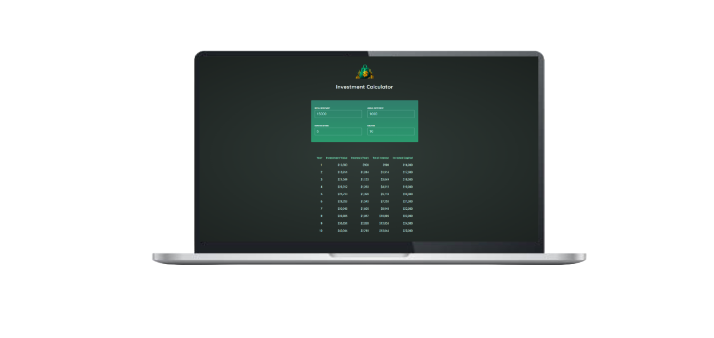

<h1 align="center">
  Investment Calculator
</h1>

  

## ✨ Tecnologias

Esse projeto foi desenvolvido com as seguintes tecnologias:

- [React](https://react.dev)
- [SCSS](https://sass-lang.com)
- [JavaScript](https://developer.mozilla.org/pt-BR/docs/Web/JavaScript)
- [Vite](https://vitejs.dev)

## 💻 Projeto

O Investment Calculator é um app que permite calcular o retorno de um investimento ao longo de anos.

## 🔖 Acesso

[Investment Calculator](https://investment-calculator-0.netlify.app)

## 🚀 Como executar

- Clone o repositório
- Instale as dependências com `npm install`
- Inicie o servidor com `npm run dev`

Agora você pode acessar [`localhost:5173`](http://localhost:5173) do seu navegador.

---
